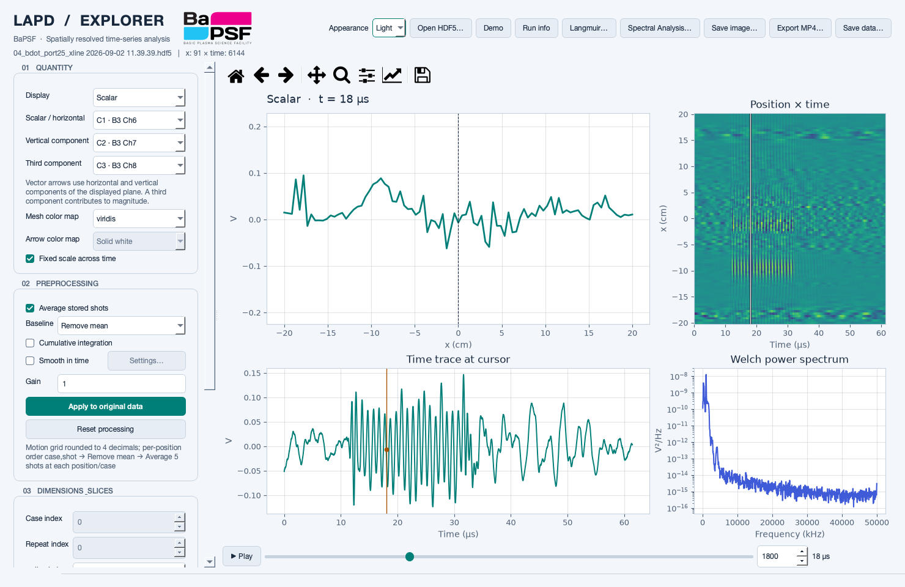
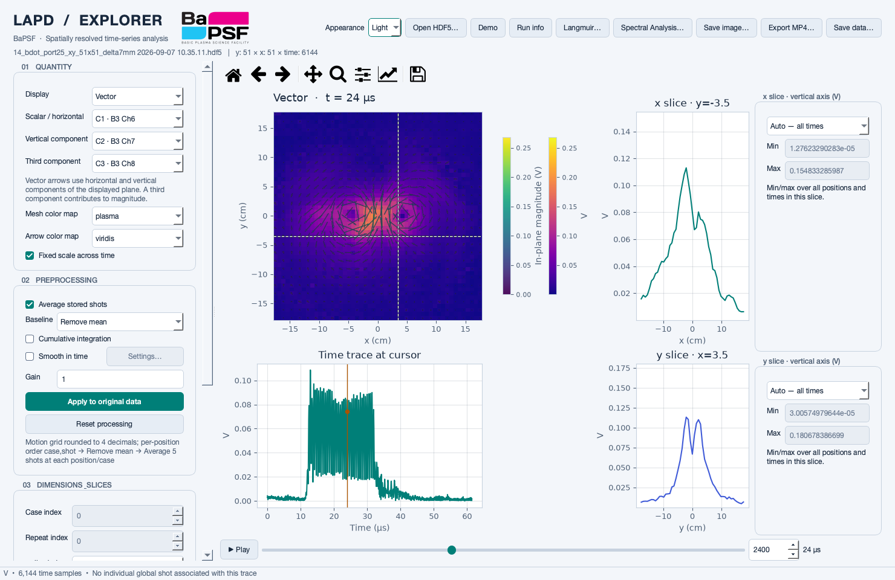

# LAPD Explorer


LAPD Explorer is a cross-platform Python desktop application for inspecting,
processing, visualizing, and exporting BaPSF / Large Plasma Device (LAPD) HDF5
time-series data. It uses PySide6, Matplotlib, NumPy, SciPy, and `bapsflib`.



*A real three-channel x-line acquisition after stored-shot averaging and mean
removal. The application starts in Light mode; Dark mode remains available from
the Appearance menu.*

## Highlights

- Opens BaPSF acquisitions through `bapsflib.lapd.File`, as well as numeric raw
  HDF5 datasets and portable HDF5 files previously exported by the application.
- Maps point, line, and plane acquisitions with named spatial, case, shot, and
  time axes.
- Displays scalar, absolute, two/three-component magnitude, and plane-vector
  views with linked slices and time traces.
- Applies per-trace baseline removal, detrending, integration, temporal
  smoothing, gain, and stored-shot averaging without modifying the source file.
- Provides Welch spectra, cross-spectral analysis, covariance, and Langmuir
  probe analysis.
- Exports PNG, SVG, or PDF figures; H.264 MP4 movies; and portable HDF5 data.

## Requirements

- A 64-bit installation of Python 3.11 or newer.
- macOS, Linux, or Windows with a graphical desktop session.
- Enough memory for the selected acquisition range. Selected data are held in
  memory; large files can be limited with the first/stop record controls.
- Git, if cloning the repository. Git is not needed when using GitHub's
  **Code → Download ZIP** option.

Python installs the application dependencies, Qt, and the FFmpeg executable used
for movie export. A separate Qt or FFmpeg installation is normally unnecessary.

## Install from a fresh GitHub download

### 1. Get the source

Clone the repository:

```text
git clone https://github.com/svincena/bapsf_hdf5_explorer.git
cd bapsf_hdf5_explorer
```

Alternatively, download the ZIP from GitHub, extract it, and open a terminal in
the extracted `bapsf_hdf5_explorer` folder. Every command below must be run from
that folder—the one containing `pyproject.toml`.

### 2. Create an isolated environment and install

The commands deliberately use the virtual environment's Python directly, so
activation is optional and Windows PowerShell execution-policy settings do not
get in the way.

#### macOS

First confirm that `python3 --version` reports 3.11 or newer. If it does not,
install a current Python from [python.org](https://www.python.org/downloads/macos/)
or another trusted Python distribution. Then run:

```sh
python3 -m venv .venv
.venv/bin/python -m pip install --upgrade pip setuptools wheel
.venv/bin/python -m pip install -e .
```

#### Linux

Install Python, its virtual-environment support, and Git using your distribution's
package manager if they are not already available. Confirm that
`python3 --version` reports 3.11 or newer, then run:

```sh
python3 -m venv .venv
.venv/bin/python -m pip install --upgrade pip setuptools wheel
.venv/bin/python -m pip install -e .
```

On Debian/Ubuntu, a missing `venv` module is usually supplied by the
`python3-venv` package. LAPD Explorer must be launched from a graphical session;
see [Troubleshooting](#troubleshooting) if Qt reports a missing Linux display
library.

#### Windows (PowerShell or Command Prompt)

Install a current 64-bit Python from
[python.org](https://www.python.org/downloads/windows/) if needed. The Python
installer's `py` launcher makes it easy to select Python 3. Verify that
`py -3 --version` reports 3.11 or newer, then run:

```powershell
py -3 -m venv .venv
.\.venv\Scripts\python.exe -m pip install --upgrade pip setuptools wheel
.\.venv\Scripts\python.exe -m pip install -e .
```

If the `py` command is unavailable but `python` reports a suitable version,
replace `py -3` in the first command with `python`.

### 3. Start the application

On macOS or Linux:

```sh
.venv/bin/python -m lapd_explorer
```

On Windows:

```powershell
.\.venv\Scripts\python.exe -m lapd_explorer
```

The installed `lapd-explorer` command is also available inside the virtual
environment, but `python -m lapd_explorer` is the most dependable form on every
platform. The application opens with a synthetic two-component plane wave, so
you can explore the controls without an HDF5 file.

### Optional: activate the environment

Activation lets you type `python` and `lapd-explorer` without their full paths:

| Shell | Command |
| --- | --- |
| macOS/Linux (`bash` or `zsh`) | `source .venv/bin/activate` |
| Windows PowerShell | `.\.venv\Scripts\Activate.ps1` |
| Windows Command Prompt | `.venv\Scripts\activate.bat` |

Run `deactivate` when finished. Activation is a convenience, not an installation
requirement.

## First run

1. Start with the built-in **Demo** data or select **Open HDF5…**.
2. For a BaPSF file, select one to three digitizer channels and, when available,
   a motion control. For a generic file, choose **Raw HDF5**, select numeric
   datasets, and provide the sample interval and signal units.
3. Confirm the inferred dimension mapping. Case and shot counts remain editable.
4. Select **Load acquisition**. Source files are always opened read-only.
5. Choose the displayed quantity and components, set any preprocessing options,
   and select **Apply to original data**.
6. Move through time with the frame control or **Play**. Click a line or plane to
   move the linked spatial cursor.
7. Use **Save image…**, **Export MP4…**, or **Save data…** for output.

Processing always starts from the imported original, so applying integration or
gain twice does not apply the operation twice. **Reset processing** returns to
the imported values. Changing Light/Dark appearance preserves the data,
processing, component assignments, colormaps, and slice settings.

## Loading BaPSF acquisitions

The importer discovers digitizers, ADC configurations, channels, and motion
controls through `bapsflib`. Multiple channels must have compatible record and
time axes. Use Command-click on macOS or Ctrl-click on Windows/Linux to select
several channels.

### Motion mapping

Motion grouping requires a complete rectangular grid with the same number of
records at every position. When a channel is selected, the importer samples the
records, assumes one case, and fills **Number of shots per case** from repeated
positions. Replace that guess when the acquisition contains multiple cases.

Within each position, acquisition order is interpreted as either `case, shot`
(shot fastest) or `shot, case` (case fastest). Cases cannot be inferred reliably
from position and global shot number alone. Single case/shot dimensions are
removed; the importer never invents statistical repeats.

Target coordinates usually recover the intended scan grid. Measured coordinates
retain real positioning deviations. Both target and measured per-record
coordinates are preserved in export metadata, along with the source used for
each channel. When measured positions are grouped, choose decimal rounding that
is fine enough for the physical scan spacing.

Missing grid points, unequal repeats, three-dimensional scans, and mismatched
vector shot/time axes are rejected. Select a balanced record range or prepare a
subset and use manual mapping.

### Manual and raw-HDF5 mapping

Add manual axes in slowest-to-fastest acquisition order, excluding time. The
axis-size product must equal the number of records. Start/end values describe
evenly spaced coordinates, and every non-singleton axis must increase.

| Stored layout | Manual axes, in order |
| --- | --- |
| Single trace `(nt,)` | No axes |
| Point with repeats `(nshot, nt)` | `shot` |
| Line without repeats `(nx, nt)` | `x` |
| Line with repeats `(nx, nshot, nt)` | `x, shot` |
| Plane with cases/repeats `(ny, nx, ncase, nshot, nt)` | `y, x, case, shot` |
| Complete plane scanned again for each case | `case, y, x, shot` |

For **Raw HDF5**, the final source axis is time and all leading axes are flattened
before manual mapping. Raw values receive no automatic ADC calibration or global
shot-number association. A raw `(nx, nt)` dataset must therefore be mapped as
`x`, rather than interpreted as repeated point measurements.

## Verified example acquisitions

The source acquisitions are not included in this repository. These settings are
recorded so collaborators with the same September 2026 data can reproduce the
validated imports.

### X-line sample

For `04_bdot_port25_xline 2026-09-02 11.39.39.hdf5`:

1. Select board **3**, channels **6, 7, 8**.
2. Select motion control **bmotion / 3 - <Hermes> p25_C16_Nx91_Lx40cm**.
3. Keep **Motion coordinates** and **Target if available**. Selecting a channel
   should infer **1 case** and **5 shots per case**.
4. Select **Load acquisition**.

The validated result is `(x=91, shot=5, time=6144)`, with x from -20 to +20 cm,
global shots 1–455, and a 10 ns sample interval. The channels correspond to Bx,
By, and Bz in the run notes, but their imported amplitudes are digitizer volts.
Probe/amplifier calibration is required for magnetic-field units; integration
alone produces V·s.

The time origin defaults to the first digitizer sample. Enter another origin in
seconds only when a known plasma-relative trigger offset is available. The
application does not infer timing offsets from free-text notes.

### Plane sample

For `14_bdot_port25_xy_51x51_delta7mm 2026-09-07 10.35.11.hdf5`, select board
**3**, channels **6–8**, motion
**bmotion / 0 - <Hermes> p25_C16_51x51_deta7mm**, and **Target if available**.
The importer should infer **1 case** and **5 shots per case**.



*The verified 51 × 51 plane in Light mode, with independent mesh/arrow colors,
linked x/y slices, and their all-time vertical scales.*

The complete result was verified as `(y=51, x=51, shot=5, time=6144)`: 13,005
global shots, 0.7 cm spacing, x/y extents of -17.5 to +17.5 cm, and 10 ns
sampling. Mapped signals and coordinates were compared with direct `bapsflib`
reads. The full GUI import, averaged baseline correction, three-component
magnitude, plane arrows, linked slices, still export, and MP4 export were also
exercised.

The run notes label all three channels “Bx”. The application preserves the
board/channel identifiers and leaves physical component assignment to the user;
the validation does not assume that the notes establish the correct vector
basis.

## Processing and interpretation

Operations run in this order:

```text
baseline → integration → time smoothing → gain → stored-shot average
```

- Mean removal and linear detrending are applied independently to each trace.
- Integration is cumulative trapezoidal integration over the actual time
  coordinates, with initial value zero.
- Shot averaging never averages cases or spatial positions.
- Magnitude is calculated after preprocessing each component. Averaging
  components before magnitude is not equivalent to averaging per-shot
  magnitudes.
- Nonfinite values propagate through means and integration. Detrending and PSD
  reject nonfinite traces. No uncertainty is invented for hardware-averaged or
  single-shot data.

### Temporal smoothing

Enable **Smooth in time**, then open **Settings…** to choose moving average,
Savitzky–Golay, Gaussian, or zero-phase Butterworth filtering. Butterworth
supports low-pass, high-pass, and band-pass filters. Cutoffs are in Hz and must
be below the Nyquist frequency; a band-pass also requires lower < upper.

Moving/Savitzky–Golay windows and Gaussian sigma are in samples. They operate in
sample-index space on irregular grids. Butterworth sampling frequency is inferred
from uniformly spaced time coordinates. Missing values may propagate or be
interpolated along time; entirely missing traces remain NaN. All selected filter
settings are written to exported processing history.

### Plots and playback

Vector arrows use the first two assigned components in the displayed plane. A
third component contributes only to the magnitude background. Use channels with
matching physical units and calibration. Mesh and arrow colormaps are
independent; colored arrows receive their own scale bar. **Fixed scale across
time** locks both color ranges.

Frame stride changes playback/export sampling only. Processing, cursor traces,
and PSD use the full time resolution. The line position–time preview may
subsample its display to remain responsive.

For planes, each slice has its own vertical-axis control:

- **Auto — all times** uses the finite range across every position and time in
  that slice for the current quantity, case, and shot.
- **Manual** accepts explicit minimum/maximum values in displayed signal units.
- **Interactive** preserves toolbar zoom/pan as time advances; **Home** restores
  the full-time slice range.

Still images and movies preserve the selected slice limits.

## Analysis tools

### Spectral analysis

Assign one or two channels with the existing component selectors, set unused
components to **None**, and open **Spectral Analysis…**. The tool uses the
currently processed dataset and preserves spatial geometry, cases, and stored
shots. It provides Welch auto/cross-power, coherency, coherence, cross-phase,
lag-domain covariance, and scalar/vector animations.

See [Spectral Analysis](docs/spectral.md) for the complete workflow,
normalization, sign conventions, shot averaging, and amplitude interpretation.

### Langmuir probe analysis

Import sweep-voltage and sweep-current digitizer channels in volts, then select
**Langmuir…**. This analysis uses the original imported channels independently
of main-browser integration, smoothing, or shot averaging.

1. Assign `V_sweep` and `I_sweep`. Voltage attenuation is a multiplier:
   `V_probe = V_digitizer × V_attenuation`. Current is calculated as
   `(I_digitizer − offset_volts) × I_attenuation / resistance_ohms`, with optional
   sign inversion. Enter collection area in mm².
2. Use **Configure current offset…** to select a zero-current interval or enter a
   known digitizer-voltage offset. Without correction, explicitly confirm that
   current zero was independently calibrated.
3. Select a rising sweep containing enough ion, retarding, and electron branches
   for fitting; exclude the rapid return. Graphical and numeric interval controls
   stay synchronized to recorded samples.
4. Adjust binning, smoothing, fit method, fit quality, and physical-range settings
   as needed.
5. Use **Process This Shot** for a representative result or **Process All Shots**
   for every location/case/repeat. Rejected fits become NaN and are summarized.

Results include Te, ne, plasma potential, and floating potential. Settings are
session-local. Leaving the dialog preserves its state for the current dataset;
loading another dataset discards it. Main-browser data and the original HDF5 file
remain unchanged.

## Export behavior

- **Save image…** captures the complete current visualization, including linked
  slices and time trace.
- **Export MP4…** renders the inclusive first/last frame range at the selected
  stride and FPS. A canceled or failed export does not replace an existing file.
- **Save data…** writes every currently processed channel, case, spatial point,
  and time sample. It does not crop to the cursor or movie frame range. The
  portable HDF5 result can be reopened directly in LAPD Explorer.
- **Run info** displays acquisition details, dimensions, units, metadata, and
  processing history.

## Updating or reinstalling

For a Git clone, pull changes and refresh dependencies with:

```sh
git pull
.venv/bin/python -m pip install -e .
```

On Windows, replace `.venv/bin/python` with
`.\.venv\Scripts\python.exe`. If an installation becomes inconsistent, delete
only the repository's `.venv` directory, recreate it with the platform-specific
commands above, and reinstall.

## Troubleshooting

### `python3`, `py`, or Python 3.11+ is not found

Install a current 64-bit Python, close and reopen the terminal, then recheck the
version. Do not use `sudo pip`; keep the installation inside `.venv`.

### `lapd-explorer` is not recognized

Use the full `python -m lapd_explorer` launch command shown above. It does not
depend on the environment's script directory being on `PATH`.

### PowerShell refuses to run `Activate.ps1`

Activation is optional. Use `.\.venv\Scripts\python.exe` directly; no execution
policy change is needed.

### Qt reports that a Linux platform plugin cannot be initialized

Launch from a graphical desktop, not a text-only SSH session. A minimal Linux
installation may also need its distribution's XCB/EGL runtime libraries. On
Debian/Ubuntu, the commonly missing packages are `libxcb-cursor0`,
`libxkbcommon-x11-0`, and `libegl1`; package names differ on other distributions.

### Dependency installation tries to compile a large package

Confirm that the environment uses a supported 64-bit CPython and that `pip` is
current. Current Python versions normally receive binary wheels for PySide6,
NumPy, SciPy, Matplotlib, Astropy, and h5py.

### A file opens as Raw HDF5 instead of BaPSF data

The file may not contain the LAPD metadata expected by `bapsflib`. Select numeric
datasets and use manual mapping, or verify that the intended acquisition file was
chosen.

## Development

See [Development and validation](docs/development.md) for test installation,
headless commands on every platform, real-sample verification, screenshot
regeneration, and the code map.

API behavior has been checked against `bapsflib` 2026.4.0 and its
[official LAPD documentation](https://bapsflib.readthedocs.io/en/latest/using_lapd/main.html).

## Current scope

Irregular point clouds and volume scans are not supported. Raw import assumes a
final time axis. Calibration, arbitrary per-shot parameter tables, per-channel
time-offset correction, and out-of-core processing remain extension points.

## Credits

This tool was developed at the Basic Plasma Science Facility, which is a
Collaborative Research Facility funded by the U.S. Department of Energy.

LAPD Explorer was vibe coded by Stephen Vincena with the aid of OpenAI Codex
using Astra and Sol models.
