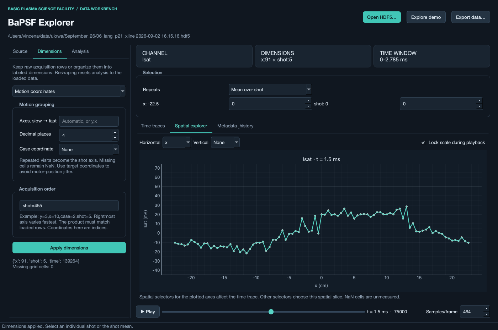

# BaPSF HDF5 Explorer

A standalone **PyQt6 desktop application** for browsing BaPSF digitizer channels,
viewing time traces, reconstructing spatial scans, and applying baseline
subtraction and time-domain filters. Interactive plotting uses pyqtgraph; labeled
arrays use xarray. HDF5 reading, shot association, and digitizer scaling use
bapsflib.



Additional screenshots: [time trace](docs/sample-trace.png) and
[synthetic 2D scan](docs/demo-spatial.png).

## Run

The local `.venv` is already configured in this workspace:

```bash
.venv/bin/python -m bapsf_explorer --demo
```

Open a file catalog directly:

```bash
.venv/bin/python -m bapsf_explorer '/path/to/experiment.hdf5'
```

For a fresh installation (Python 3.11+; tested with Python 3.12 on macOS):

```bash
python3 -m venv .venv
source .venv/bin/activate
python -m pip install -e '.[dev]'
bapsf-explorer --demo
```

On Windows activate with `.venv\Scripts\activate`. This is a desktop Python
application; a bundled `.app`/`.exe` installer is not included yet.

## First workflow

1. **Open HDF5**. Source lists active digitizer channels and their `Data type`
   labels. Change **Display name** before loading to override a label.
2. Select the row/sample range. The initial preview reads up to **50 records**
   with the full time window. Stops are exclusive and indices are zero-based.
   **Use all records** selects the complete channel. A single-channel read is
   limited to 512 MiB of signal data; processing requires additional memory.
3. Choose the motion device/configuration and **Target grid** or **Measured
   positions**, then **Load channel**. Matching uses bapsflib's shot intersection;
   the status bar reports requested records omitted because they did not match.
4. In **Dimensions**, choose **Motion coordinates** and **Apply dimensions**.
   Leave axes blank to use varying x/y/z coordinates, or enter an explicit order
   such as `y,x`. Repeated visits become the `shot` dimension.
5. Use the selection controls to choose position, case, and individual shot or
   shot mean. The time trace is the selected point; spatial plots span the chosen
   horizontal/vertical axes and retain the other selections. Choose vertical
   **None** for a 1D profile. Wheel zoom and drag pan are available in the plots.
6. Drag the time slider or the gold time-trace cursor. **Play** animates spatial
   profiles; **Samples/frame** controls temporal stride for display only.
   Locking the scale keeps a consistent range throughout an animation.
7. In **Analysis**, enable baseline subtraction and select an interval in **ms**.
   Choose a lowpass, highpass, or bandpass filter with cutoffs in **Hz**, then
   **Apply analysis**. A bandpass accepts `low,high`. The gray trace shows the
   original data. **Reset analysis** restores it.
8. **Export data** saves the full current processed array as NetCDF/HDF5, including
   dimensions, coordinates, shot IDs, units, and processing history. Display-only
   selections and averaging are **not** applied to the export. Reopen with:

   ```python
   import xarray as xr
   ds = xr.open_dataset("analysis.nc", engine="h5netcdf")
   signal = ds["signal"]
   averaged = signal.mean("shot", skipna=True)
   ```

## Validated sample

The provided September 2, 2026 x-line scan exposes `Isat`, `Isweep`, and `Vsweep`
on SIS 3302 board 2, channels 1–3. Each has 455 records × 139,264 samples;
the effective interval is 20 ns, including hardware sample averaging. Target
coordinates reconstruct **`(x=91, shot=5, time=139264)`**, from −22.5 to +22.5 cm
in 0.5 cm steps. Measured positions have small motor-position deviations, which
is why target coordinates are the default for grid grouping. Data remain in
digitizer volts; probe-specific calibration is not inferred from channel names.

## Data model and ordering

- Reads produce `(record, time)` with original global `shot_id` and available
  per-record spatial coordinates. `record` is a local row index, not a global
  shot number. Time is stored in seconds and displayed in milliseconds.
- Motion grouping sorts coordinate values and assigns each waveform by its
  position. It works for raster, reversed, or serpentine acquisition order.
  `shot` is the repeat index **at that position and case**, in acquisition order;
  it is not a simultaneous-shot index across different positions.
- Measured x/y/z are retained as auxiliary coordinates when grouping target
  positions. Rounding (default 4 decimal places in the coordinate's native unit)
  determines which positions are equal. Choose axes explicitly when working
  with measured positions affected by off-axis jitter.
- Missing cells/repeats contain NaN and `shot_id=-1`. Means skip missing values;
  no interpolation is performed. Large sparse Cartesian grids are rejected by
  an allocation guard.
- **Acquisition order** accepts `y=3,x=10,case=2,shot=5` or simpler forms like
  `y=91,shot=5`, `x=455`, and `shot=455`. The rightmost listed dimension varies
  fastest; time is always last. Sizes must exactly match the loaded record
  count. These new dimension coordinates are **indices**, while original
  physical positions remain auxiliary coordinates named `position_x`, etc.
- Case labels cannot generally be inferred from repeated shots. The Python API
  accepts explicit per-record case labels during motion grouping. The GUI's
  acquisition-order mode supports a case dimension; a per-record case-file
  import is a future extension. The demo includes two explicit cases.
- In raw-record mode, **Mean over record** averages every loaded row, including
  different positions. Group by motion first to average repeats at each position.

## Analysis behavior

Baseline subtraction computes an independent interval mean for every trace.
Filtering then operates along the named time axis using a Butterworth
second-order-section forward/backward filter. It has zero phase shift, with the
squared magnitude response of the single-pass filter. The entered order is the
single-pass design order. Cutoffs must lie below Nyquist. Nonuniform sampling,
partial NaN traces, and windows shorter than the padding requirement produce
actionable errors; wholly missing grid traces remain NaN.

Every Apply starts from the original reshaped data, so repeated clicks do not
compound processing. Averaging happens after processing for display. Reshaping
or loading new data clears analysis. A filter's edge behavior depends on the
loaded interval; load surrounding samples when interpreting an interior window.

## Development

```text
src/bapsf_explorer/
  reader.py     bapsflib file catalog and bounded read-only data adapter
  data.py       xarray representation, motion grouping, manual reshaping, demo
  analysis.py   baseline subtraction and validated filtering
  window.py     PyQt6 workbench, worker tasks, selection and plotting
  theme.py      desktop palette
  __main__.py   command-line entry point
tests/          scientific invariants, GUI workflows, optional real-file checks
```

The data and analysis layers have no Qt dependencies:

```python
from bapsf_explorer.reader import inspect_file, read_channel
from bapsf_explorer.data import motion_reshape
from bapsf_explorer.analysis import subtract_baseline, filter_signal

catalog = inspect_file("experiment.hdf5")
ch = catalog.channels[0]
raw = read_channel(catalog.path, ch,
                   rows=slice(0, ch.records), samples=slice(0, 10000),
                   motion=catalog.motions[0], position_source="target")
grid = motion_reshape(raw, axes=["x"])
corrected = subtract_baseline(grid, 0, 20e-6)  # seconds in the Python API
filtered = filter_signal(corrected, "lowpass", 100_000)
mean = filtered.mean("shot", skipna=True)
```

Run checks:

```bash
.venv/bin/python -m pytest -q
BAPSF_TEST_FILE='/path/to/the/provided/xline.hdf5' .venv/bin/python -m pytest -q
```

The optional real-file tests describe the supplied 91-point x-line fixture and
read it without modifying it. GUI tests use Qt's offscreen platform. Dependencies
are declared in `pyproject.toml`; `requirements-tested.txt` records the exact
versions used during local validation, excluding unused Qt bindings.

## Scope of this first version

One channel is loaded at a time. Reads and full-array processing run in a worker
thread; loaded data are in-memory NumPy arrays. Out-of-core/Dask analysis,
multi-channel derived quantities (including Langmuir I–V fits), movie export,
persistent sessions, case-table import, and packaged installers are future work.
No acquisition controls or network connections to motion hardware are used.

The reader currently targets LaPD-format files through `bapsflib.lapd.File`.
Channel metadata extraction is validated for SIS crate configurations, with a
dataset-attribute label lookup and board/channel fallback for other digitizers.
Dedicated time datasets must identify units; unsupported formats fail explicitly
instead of inventing timing. Motion units are taken from a bmotion configuration
when unambiguous, otherwise labeled `native` for user interpretation.

Useful upstream references: [bapsflib file API](https://bapsflib.readthedocs.io/en/latest/api/bapsflib.lapd._hdf.file.File.html),
[bapsflib usage](https://bapsflib.readthedocs.io/en/latest/using_lapd/main.html),
and [pyqtgraph](https://pyqtgraph.readthedocs.io/en/latest/).
